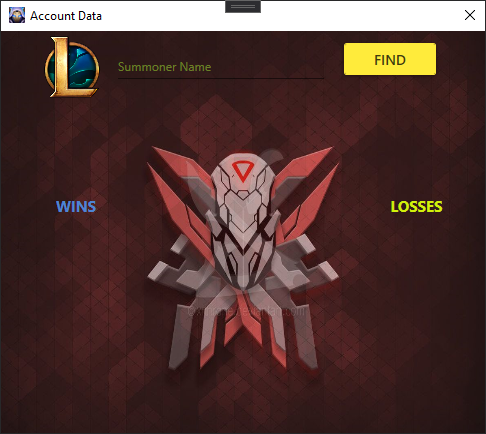
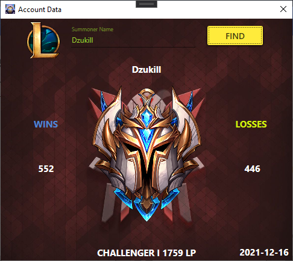
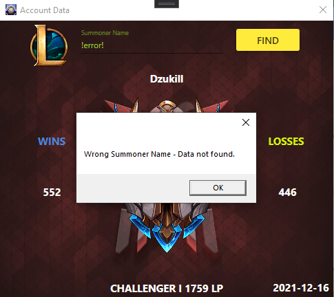

# Account_Manager
MVVM Pattern in WPF using external API.
## Table of Contents
* [General Info](#general-informations)
* [Features](#features)
* [Screenshots](#screenshots)
* [Project Status](#project-status)
* [Contact](#contact)
## General Informations
An application that uses an external API - in my case – Riot Games API. After entering the correct account name in the text box app will display user’s name, number of wins and losses, current division and when his data were recently updated.
## Technologies Used
- Autofac 5.2.0
- AutoMapper 9.0.0
- Fody 6.1.1
- Newtonsoft.Json 12.0.3
- RestSharp 106.11.4
- MaterialDesignColors 1.2.6
- MaterialDesignThemes 3.1.3
## Features
- Display Raid Boss Status
- Refresh Raid Boss Status
## Screenshots

## Project status
Project is: complete.
## Contact
Created by @szy.szymalski@gmail.com - feel free to contact me!
